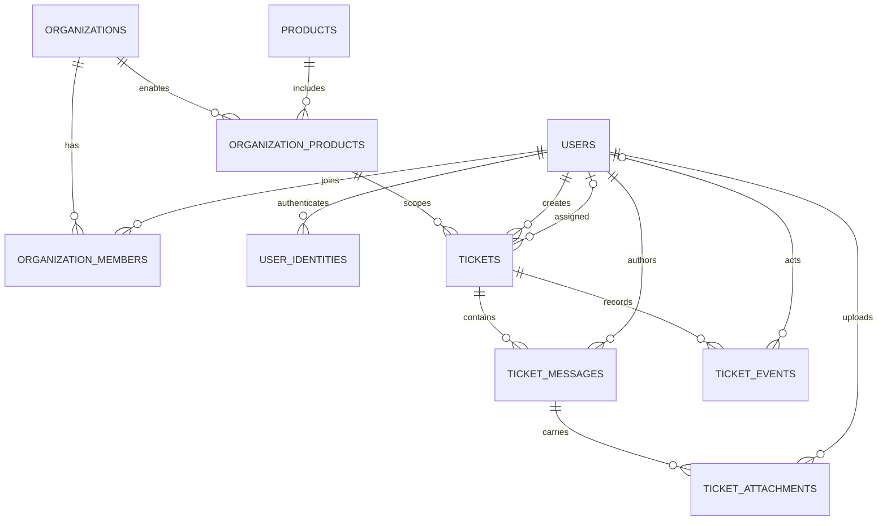

# Modelo de dados do Portal KoddaHub

`ORGANIZATION_PRODUCTS` é também a fronteira de integridade dos tickets: a FK composta impede que um ticket associe uma organização a um produto não habilitado para ela. O diagrama omite colunas para destacar as relações; as constraints completas estão nas migrations.
