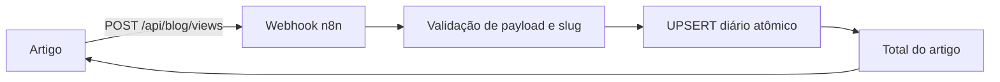

# Compartilhamento e visualizações do Blog

**Documento:** KDH-BLOG-002
**Versão:** 1.0
**Status:** Em revisão
**Última atualização:** 15/09/2026
**Responsável:** Koddahub
**Classificação:** Uso interno

## Redes sociais

A fonte de verdade é `config/site.json`, no campo `social_links`. Cada item usa
`network` e uma URL HTTPS oficial. O build aceita Instagram e LinkedIn e rejeita
host divergente. Uma lista vazia remove toda a área social do footer; em
15/09/2026 nenhuma URL oficial estava confirmada e nenhuma rede foi exibida.
WhatsApp permanece um canal comercial separado.

## Compartilhamento

Cada artigo oferece Web Share API quando o navegador a suporta e mantém os
fallbacks WhatsApp, LinkedIn e Copiar link. O payload usa título e canonical do
artigo. O feedback de cópia usa região `aria-live`, sem `alert()`. Os links de
compartilhamento não recebem UTM nesta versão.

## Visualizações

“Visualizações” é a quantidade registrada pelo contador editorial do Blog. Não
representa pessoas, usuários únicos, alcance, sessões ou dados do GA4.

O navegador consulta o total a cada abertura e pede um incremento por artigo em
cada sessão do navegador. A chave `sessionStorage` é
`koddahub:view:<slug>`; ela reduz duplicações acidentais, mas não é mecanismo de
segurança nem identificação de pessoa. Se storage ou endpoint falhar, a leitura
do artigo continua e o contador é ocultado.



A rota first-party é encaminhada ao workflow `KDH | Blog | Article Views`. O
contrato aceita apenas POST JSON com no máximo 512 bytes após normalização:

```json
{"article_slug":"slug-publicado","increment":true}
```

A resposta pública contém somente `success`, `article_slug` e `views`. Slugs
precisam obedecer ao formato seguro e existir ativos em `blog_articles`.

O KoddaFocus agrega uma linha por artigo/dia em `blog_article_views`. O UPSERT
incrementa `views` atomicamente. `blog_view_rate_limits` limita globalmente 300
incrementos por minuto sem armazenar IP, user-agent, cookie, e-mail ou outra
PII. A tabela agregada permite total, evolução diária e futuras listas de mais
lidos sem registrar uma linha por acesso.

## Estado operacional

A migration `012-create-blog-article-views.sql` está aplicada. O workflow está
importado e inativo porque a credencial existente `KoddaFocus Postgres` não
autentica no PostgreSQL atual. Frontend, proxy e workflow não devem ser
publicados enquanto o teste integrado não passar.

Depois de corrigir a credencial sem expor seu valor:

1. ativar o workflow e reiniciar o runtime n8n;
2. validar consulta, incremento, slug inválido e limite;
3. testar `/api/blog/views` no domínio first-party;
4. validar sessão, reload, nova sessão e falha tolerada;
5. executar build, deploy e QA responsivo em 360, 390, 576, 768, 992, 1200 e
   1440 px.
